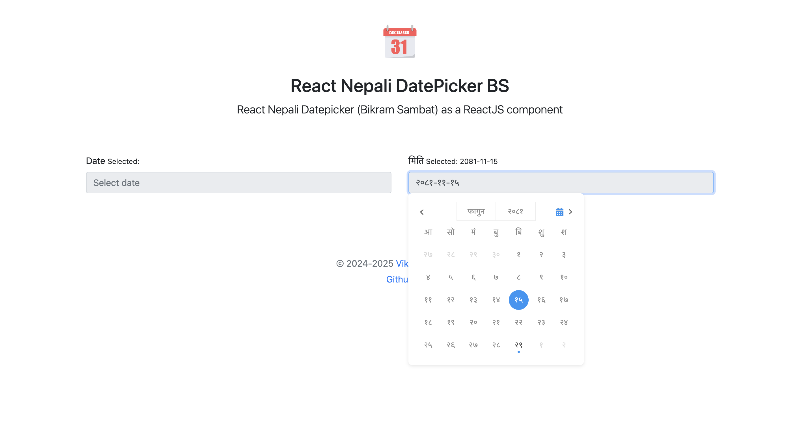

# React Nepali Type

> ReactJS input component to type Nepali in Preeti ASCII and convert it into unicode

[](https://www.npmjs.com/package/react-nepali-type)
[](https://standardjs.com)

## Demo



## Install

```bash
npm install --save react-nepali-type

or,

yarn add react-nepali-type
```

## Usage

#### For Typescript

```tsx
import React, { useState } from "react"
import { NepaliType } from "react-nepali-type"
import "react-nepali-type/dist/index.css"

const App = () => {
    const [date, setDate] = useState<string>("")

    return (
        <form>
            <label htmlFor='date'>Date</label>
            <NepaliType
                inputClassName='form-control'
                className=''
                value={date}
                onChange={(value: string) => setDate(value)}
                options={{ calenderLocale: "ne", valueLocale: "en" }}
                placeholder={"Enter DOB"}
                todayIfEmpty={false}
            />
        </form>
    )
}

export default App
```

#### For JavaScript

```jsx
import React, { useState } from "react"
import { NepaliType } from "react-nepali-type"
import "react-nepali-type/dist/index.css"

const App = () => {
    const [date, setDate] = useState("")

    return (
        <form>
            <label htmlFor='date'>Date</label>
            <NepaliType
                inputClassName='form-control'
                className=''!
                value={date}
                onChange={(value) => setDate(value)}
                options={{ calenderLocale: "ne", valueLocale: "en" }}
                placeholder={"Enter DOB"}
                todayIfEmpty={false}
            />
        </form>
    )
}

export default App
```
